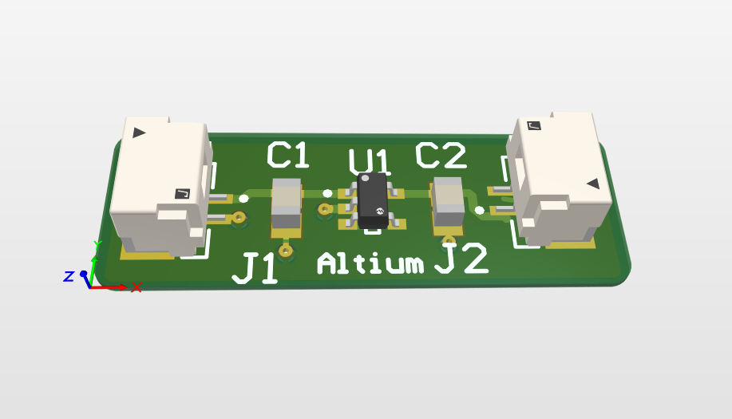

# 5V to 3.3V Voltage Regulator (Altium Project)

This is a beginner-level Altium Designer project that converts 5V input to a stable 3.3V output using a MIC5317 voltage regulator. It includes basic schematic design and PCB layout, making it perfect for learning how to use Altium and understanding voltage regulation in embedded systems.

## Project Overview

- **Input Voltage**: 5V  
- **Output Voltage**: 3.3V  
- **Regulator Used**: MIC5317-3.3YM5-TR  
- **Capacitors**: 2 × 1µF  
- **Connectors**: 2 × JST SM02B-GHS-TB (LF)(SN)

## Components

| Component     | Description                  |
|---------------|------------------------------|
| MIC5317       | Low-dropout (LDO) regulator  |
| C1, C2        | 1µF ceramic capacitors       |
| J1, J2        | 2-pin connectors (JST)       |

## Files Included

- **Schematic** (`.SchDoc`)
- **PCB Layout** (`.PcbDoc`)
- **3D View Screenshot**
- **Schematic Diagram Image**

## Preview

### Schematic  

### 3D PCB View  

---

Feel free to clone or modify this project to suit your needs as you explore PCB design using Altium!

